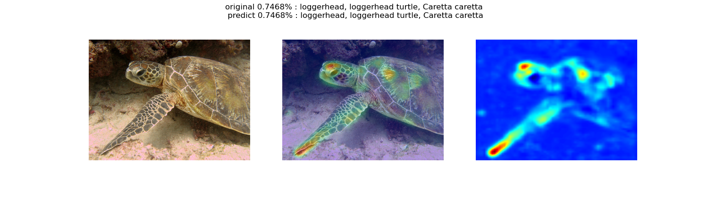

### Residual_U-net_image-net
   
   
Main concept of Residual U-net is add decoding section at Resnet model which maid by pytorch.   
https://pytorch.org/vision/0.8/_modules/torchvision/models/resnet.html   
   
Traditional Resnet type models just have downsample layer,
these layers reduce width and height of weight matrix.   
It is fine when just using in classification, classify process don't need local feature.   
   
But when extract feature map like Class Activation Map (CAM),
low size of weight matrix is critical to represent detail local feature.   
Then we maintained classificater concept of model and added decoding section to restore original size of input data.   
   
Main structure is appeared by this picture   

   
We consider about padding calibration process in upsampling at decoding section.   
This method prevent occurred different size of encoding section output data to decoding section output data.   
Main reason of this process is concatenate encoding data to decoding data to making traditional concept of U-net.   
   
Decoding residual block structure is appeared by this picture.   

   
---
   
Because it is too dizz that import several parameters option by using argparse module,
it's only has one option to training process.   
Variable can just set by importing csv file which recorded file path or numerical value or process setting.   
   
modelPath is pre-trained model's state_dict data's located path.   
If program can't find modelPath of file, just have initial model setting and go to next process.   
   
rootPath is image-net data path.   
   
classNamePath is class explained file.   
   
---
   
You can start model training by this code.   
   
```bash
python image_net_train.py --csv variable_0.csv
```
   
If you want to change variable setting, edit csv file or point out self-made csv file which have own setting in --csv option.   
   
During deeplearning process, each end of epoch, process export recomended analysis variable csv file that name is *_analysis_recommended.csv.   
Then you can run this python code to analyze results with recommended variable csv file.   
   
```bash
python image_net_results_anaylsis.py --csv variable_0_analysis_recommended.csv
```
   
We saved model data and results data in google drive.   
https://drive.google.com/drive/folders/1SdQNaoxdaRH2spgJS7fpGq6lPC69LZcN   
   
Typical example feature map   





